# Quick Fix Reference: Workflow #51

## ✅ What Was Fixed

Workflow #51 (Case Analysis) now **succeeds even without OpenAI API key** instead of failing.

## 🔧 Changes Made

| File | Change |
|------|--------|
| `.github/workflows/case-analysis.yml` | Added conditional execution based on API key availability |
| `scripts/analyze-cases.js` | Changed `process.exit(1)` to `process.exit(0)` when no key |
| `_docs/SETUP-OPENAI.md` | Created comprehensive setup guide |

## 🎯 Quick Actions

### To Enable AI Analysis (When Ready)

1. **Get API key**: https://platform.openai.com/api-keys
2. **Add to GitHub**:
   - Settings → Secrets and variables → Actions
   - New repository secret
   - Name: `OPENAI_API_KEY`
   - Value: Your API key (starts with `sk-`)
3. **Done!** Next workflow run will use AI

### To Verify Fix Worked

Check latest workflow run:
- ✅ Status should be green (not red)
- 📋 Summary should say "OpenAI API Key: Not configured (analysis skipped)"
- 📄 See: [_docs/SETUP-OPENAI.md](_docs/SETUP-OPENAI.md) for details

## 💡 How It Works Now

```mermaid
graph TD
    A[Workflow Triggered] --> B{API Key Set?}
    B -->|No| C[Skip Analysis]
    B -->|Yes| D[Run Analysis]
    C --> E[✅ Success with Info]
    D --> F{Changes Generated?}
    F -->|No| E
    F -->|Yes| G[Create PR]
    G --> E
```

## 📊 Cost Info

- **Without API key**: $0 (free, no AI features)
- **With API key**: ~$0.20 per case analyzed
- **Monthly estimate**: $5-20 depending on case volume

## 🔒 Security Note

Never commit API keys! Use:
- `.env` file locally (already in `.gitignore`)
- GitHub Secrets for workflows

## 📚 Documentation

- **Setup Guide**: [_docs/SETUP-OPENAI.md](_docs/SETUP-OPENAI.md)
- **Full Analysis Docs**: [_internal/ANALYSIS-SYSTEM.md](_internal/ANALYSIS-SYSTEM.md)
- **Fix Summary**: [_internal/WORKFLOW-51-FIX-SUMMARY.md](_internal/WORKFLOW-51-FIX-SUMMARY.md)
